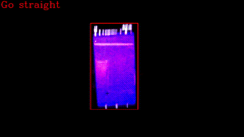

# Vision-Based Lane Following Attendant

This project is a image-processing-based lane-following system with optional hardware support and Google Sheets integration. It uses OpenCV for real-time image processing and optionally sends navigation commands to an Arduino. It also simulates basic table interactions by linking camera input with a Google Sheet.

---

## Demo

The demo showcases:

- A camera feed where a blue-colored path is recognized in real-time
- The script calculates both the midpoint offset and the tilt angle of the path
- Based on this, it prints directional decisions like: `go left`, `go straight`, or `go right`

This mimics how a self-driving robot might visually track and follow a painted path.



---

## Repository Structure

```
.
├── lane_follower.py             # Lane detection + direction logic (no Arduino)
├── lane_follower_pyserial.py    # Same as above, but sends commands to Arduino
├── vision_attendant.py          # Table assistant based on Google Sheets
├── arduino_controller.ino       # Arduino sketch (motor control)
├── requirements.txt             # Dependencies for setting up the environment
├── README.md                    # Project overview and instructions
├── demo.gif                     # Lane-following demonstration
├── .gitignore                   # Specifies untracked files to ignore in version control
├── LICENSE                      # MIT License for usage and distribution
│
├── .env                         # (add your own) Configuration file
├── credentials.json             # (add your own) Google Sheets API credentials

```

---

## Installation & Setup

### 1. Clone the repository

```bash
git clone https://github.com/Rishab-Agrawal/vision-attendant.git
cd vision-attendant
```

### 2. Create and activate a virtual environment (recommended)

```bash
conda create -n vision-attendant python=3.10
```
```bash
conda activate vision-attendant
```

### 3. Install dependencies

```bash
pip install -r requirements.txt
```
### 4. Add Google Sheets API Credentials

To use `vision_attendant.py`, follow these steps:

1. Visit [Google Cloud Console](https://console.cloud.google.com/)
2. Create a new project
3. Enable the **Google Sheets API**
4. Go to **Credentials** → Click “Create Credentials” → Select **Service Account**
5. Create the account with default settings
6. Go to the Service Account → "Keys" tab
7. Click "Add Key" → "Create new key" → Choose **JSON**
8. Download the file and save it as `credentials.json` in the project folder (or any other name, which is to be added in the .env file, explained in the below section)

You can use the sample editable sheet we used:

**Google Sheet Link:**  
https://docs.google.com/spreadsheets/d/1cCWIrncduEKPHOwDjtqpt1_EMEF7OZXgiYMQDjDHY74/edit?usp=sharing

Sample table format:

| Table  | Customer name | Ordered | Assistance/Refill | Finished | Rating |
|--------|----------------|---------|--------------------|----------|--------|
| Red    | Mr. A          | no      | no                 | no       | -      |
| Yellow | Mr. B          | no      | no                 | no       | -      |
| Green  | Mr. C          | no      | no                 | no       | -      |

Edit this sheet (or your copy) to test assistant functionality.

### 5. Configure `.env` file

Create a `.env` file in the project folder with the following contents:

```env
SERVICE_ACCOUNT_FILE = <YOUR KEY FILE NAME.json>
SAMPLE_SPREADSHEET_ID = '1cCWIrncduEKPHOwDjtqpt1_EMEF7OZXgiYMQDjDHY74'   # ID of the shared spreadsheet (link provided in README.md)
CAMERA_INDEX=0
SERIAL_PORT=/dev/ttyACM0                                                 # Only needed for lane_follower_pyserial.py
```

---

## Hardware (Optional)

### Required only for `lane_follower_pyserial.py`

If you want to run the Arduino-controlled version:

- Arduino UNO or Nano
- L298N Motor Driver
- 2 DC Motors
- USB Cable
- A track with a **blue** path

### Arduino Wiring Reference

- ENA → Pin 9  
- ENB → Pin 10  
- IN1 → 2  
- IN2 → 3  
- IN3 → 4  
- IN4 → 5  
- Motors → L298N  
- Power L298N separately if needed

> The other two scripts (lane_follower.py and vision_attendant.py) require only a laptop camera.

---

## How to Run

### A. Lane Follower (No Arduino, visual only)

```bash
python lane_follower.py
```

- Detects blue path
- Displays movement suggestion based on angle

---

### B. Lane Follower with Arduino

1. Upload `arduino_controller.ino` to your Arduino via Arduino IDE
2. Make sure your `.env` contains the correct `SERIAL_PORT` (e.g., `COM3`, `/dev/ttyUSB0`)
3. Run:

```bash
python lane_follower_pyserial.py
```

- Sends `'l'`, `'r'`, `'f'` over serial
- Motors react accordingly

---

### C. Vision Attendant (No Arduino, Google Sheets-Based)

1. Modify any "no" to "yes" in the Google Sheet
2. Run:

```bash
python vision_attendant.py
```

- It will read the sheet and stop at tables that require action (Order, Assistance, Billing), by recognizing the corresponding color
- At the billing stage, the camera window will close briefly, after which it will reopen for taking the customer rating

> Ensure some "no" values are changed to "yes" in the google sheet before running.

---

## Controls and Exiting

- Press `Esc` to stop the OpenCV window
- Use `Ctrl+C` in terminal to kill any script

---

## Future Extensions

- Replace color recognition with QR-code detection for better robustness.
- Replace Google Sheets with a simple web-based interface for user input.
- Add obstacle detection to stop movement when a blockage is detected.

---

## Author

Rishab Agrawal

---

## License

This project is licensed under the MIT License. See [LICENSE](LICENSE) for more details.
